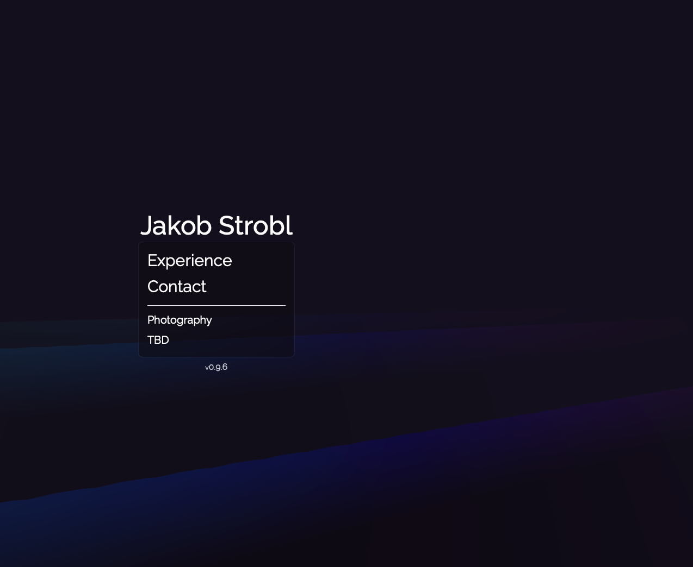

<h1 align="center">Portfolio</h1>

<p align="center">
  <strong>Designed with the shadow system for an interactive experience</strong>
</p>

<p align="center">
  <a href="#about">About</a> •
  <a href="#tech-stack">Tech Stack</a> •
  <a href="#custom-design-features">Custom Design</a> •
  <a href="#quick-start">Quick Start</a> •
  <a href="#deployment">Deployment</a>
</p>

<p align="center">
  
  <a href="https://github.com/Jakob-Strobl/portfolio/actions/workflows/prod-page-deploy.yml">
    
  </a>
  <a href="https://jstrobl.dev">
    
  </a>
  
  
</p>

---

## About

This portfolio site showcases professional experience through an interactive timeline, curated photo galleries from travels across Korea and Japan, and contact information. Built with a focus on performance, smooth animations, and custom design elements that push the boundaries of modern web development.

<p align="center">
  
</p>

## Tech Stack

- **Framework**: SolidJS with SolidStart (SSR-enabled)
- **Styling**: Tailwind CSS v4
- **3D Graphics**: Three.js with custom GLSL shaders
- **Runtime**: Bun
- **Deployment**: Cloudflare Pages with GitHub Actions CI/CD
- **Testing**: Vitest + SolidJS Testing Library
- **Language**: TypeScript (strict mode)

## Custom Design Features

### Umbra Shadow System

A custom shadow management system that dynamically tracks DOM elements and renders synchronized shadow overlays. Features include position-aware shadow rendering with both fixed and relative positioning strategies, warmup animations with configurable delays, and responsive recalculation on viewport changes. The system leverages SolidJS stores for reactive state management, creating a unique depth effect throughout the interface.

### WebGL Wave Background

Real-time procedurally generated ocean waves powered by custom GLSL vertex and fragment shaders. The wave system simulates multiple overlapping wave patterns with configurable properties including amplitude, frequency, steepness, and wind direction. It dynamically adapts to device orientation and viewport changes, with mobile-specific optimizations for smooth performance across all devices.

## Quick Start

```bash
# Prerequisites: Bun, Node >= 20 (LTS)
# Install dependencies
bun install
# Start development server
bun run dev
# Run tests
bun run test
# Build for production
bun run build
```

## Available Scripts

| Command                | Description               |
| ---------------------- | ------------------------- |
| `bun run dev`          | Start development server  |
| `bun run build`        | Production build          |
| `bun run test`         | Run test suite            |
| `bun run test-watch`   | Run tests in watch mode   |
| `bun run pretty-check` | Check code formatting     |
| `bun run prettify`     | Format code with Prettier |

## Project Highlights

- **File-based routing** with SolidStart conventions for intuitive project structure
- **Intersection Observer API** integration for performant scroll-based animations
- **Analytics integration** with PostHog for usage insights
- **Comprehensive test coverage** using happy-dom for DOM testing environment

## Deployment

Automatically deployed to Cloudflare Pages via GitHub Actions on branch updates. The CI/CD pipeline runs the full test suite before each deployment to ensure code quality and prevent regressions.

---

Built with ❤️ using SolidJS
