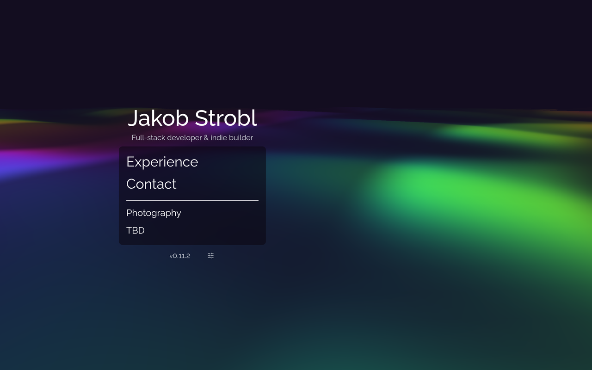
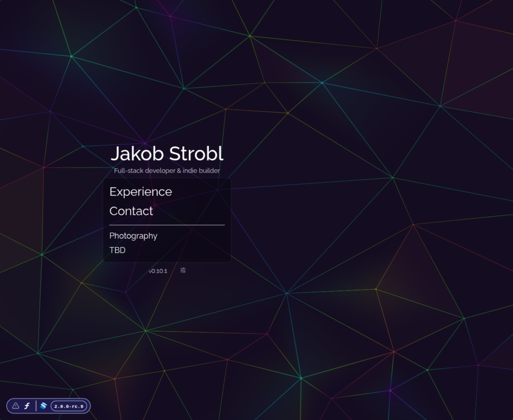

<h1 align="center">Portfolio</h1>

<p align="center">
  <strong>Designed with the shadow system for an interactive experience</strong>
</p>

<p align="center">
  <a href="#about">About</a> •
  <a href="#tech-stack">Tech Stack</a> •
  <a href="#custom-design-features">Custom Design</a> •
  <a href="#quick-start">Quick Start</a> •
  <a href="#deployment">Deployment</a>
</p>

<p align="center">
  <a href="https://github.com/Jakob-Strobl/portfolio/releases">
    
  </a>
  <a href="https://github.com/Jakob-Strobl/portfolio/actions/workflows/prod-page-deploy.yml">
    
  </a>
  <a href="https://jstrobl.dev">
    
  </a>
  
</p>

---

## About

This portfolio site showcases professional experience through an interactive timeline, curated photo galleries from travels across Korea and Japan, and contact information. It is built around a custom shadow system and lightweight WebGL backgrounds, with a focus on responsive interaction, smooth transitions, and performance.

<table>
  <tr>
    <td align="center"><strong>Waves</strong><br /></td>
    <td align="center"><strong>Tessellation</strong><br /></td>
  </tr>
</table>

## Tech Stack

- **Framework**: SolidJS with SolidStart 2 RC (SSR-enabled)
- **Styling**: Tailwind CSS v4
- **Rendering**: Multiple custom WebGL 2 effect models with custom GLSL shaders
- **Runtime**: Bun
- **Deployment**: Cloudflare Pages through Nitro's `cloudflare_pages` preset and GitHub Actions CI/CD
- **Testing**: Vitest + SolidJS Testing Library
- **Language**: TypeScript (strict mode)

### Background Payload

The background rewrite removes the old Three.js dependency and substantially reduces the effect payload. These figures compare the old production `waves` chunk with the current Vite build; gzip is recompressed from the decoded JavaScript for an apples-to-apples comparison.

| Background payload              | Uncompressed | Gzip     | Source                            |
| ------------------------------- | ------------ | -------- | --------------------------------- |
| Old production waves + Three.js | 490.7 KB     | 124.9 KB | Live `waves-CqeVZqS3.js` asset    |
| Current custom effect models    | 29.4 KB      | 10.5 KB  | Current Vite `waves` client chunk |
| Reduction                       | 16.7×        | 11.9×    | Old payload ÷ current payload     |

### Initial Payload Including Background

| Initial client + background | Uncompressed | Gzip     |
| --------------------------- | ------------ | -------- |
| Old production              | 712.5 KB     | 196.2 KB |
| Current build               | 324.3 KB     | 101.9 KB |

Including the background payload, the current build is approximately **2.2× smaller raw** and **1.9× smaller gzip** than the old production payload.

The first table isolates the background payload; the second includes the initial client assets plus the background payload.

## Custom Design Features

### Umbra Shadow System

A custom shadow management system that dynamically tracks DOM elements and renders synchronized shadow overlays. Umbra uses smooth FLIP-style transitions for entering, moving, and removing content; observes source geometry with `ResizeObserver`; snaps shadows back to their sources after resizes; and conditionally renders detached content based on source visibility. It supports fixed and relative positioning, configurable warmup/content fades, and responsive viewport synchronization. The system leverages SolidJS stores for reactive state management, creating a unique depth effect throughout the interface.

### Custom WebGL Backgrounds

- **Waves**: A redesigned, procedurally generated wave field driven by a custom WebGL 2 pipeline and custom GLSL vertex/fragment shaders. Multiple overlapping waves are seeded and animated without a third-party 3D engine.
- **Tessellation**: A second living background effect model built from a changing triangulated mesh, with evolving topology, per-facet lighting, lifecycle pulses, and smooth transitions between mesh states.

Both effects expose controls for effect selection, seed regeneration, motion speed, visual intensity, quality, and frame rate. Preferences can be saved for future sessions.

## Quick Start

```bash
# Prerequisites: Bun and Node >= 24
# Install dependencies
bun install
# Start development server
bun run dev
# Run tests
bun run test
# Build for production
bun run build
```

## Available Scripts

| Command                           | Description                                         |
| --------------------------------- | --------------------------------------------------- |
| `bun run dev`                     | Start development server                            |
| `bun run build`                   | Production build                                    |
| `bun run test`                    | Run test suite                                      |
| `bun run test-watch`              | Run tests in watch mode                             |
| `bun run pretty-check`            | Check code formatting                               |
| `bun run prettify`                | Format code with Prettier                           |
| `bun run cloudflare-step-deploy`  | Run tests, then build (used by Cloudflare Pages CI) |
| `bun run cloudflare-deploy-local` | Build and deploy to Cloudflare Pages from local dev |

### Cloudflare Deployment Scripts

- **`cloudflare-step-deploy`**: Runs the full test suite (`vitest run`) and, only if tests pass, builds the project with Vite/Nitro (`bun run build`). Dependencies are installed separately with the committed lockfile by CI.

- **`cloudflare-deploy-local`**: Builds the project with Vite/Nitro and deploys the generated `dist` directory directly to Cloudflare Pages using Wrangler CLI (`bunx wrangler pages deploy`). Useful for local testing before pushing to CI/CD.

- **`bunx wrangler deploy`**: Builds and deploys the Nitro Worker and its static assets using the checked-in `wrangler.toml`; `--dry-run` validates the upload without publishing. This targets a Cloudflare Worker, while CI and `cloudflare-deploy-local` continue to target the Cloudflare Pages project.

- **Existing checkout note**: `bun run build` removes Nitro's stale, generated `.wrangler/deploy/config.json` redirect. Run it once after pulling this configuration if `bunx wrangler deploy` still reports that it is using a redirected Pages config; clean checkouts do not have this ignored file.

## Project Highlights

- **Custom interaction systems**: Umbra coordinates detached shadows, smooth transitions, resize snapping, and visibility-aware rendering across the site.
- **Two procedural backgrounds**: Waves and tessellation are built in-house with WebGL 2 and GLSL, with runtime controls and persisted preferences.
- **SSR-first application structure**: SolidStart 2 RC file-based routing keeps the timeline, contact page, and photo galleries organized while supporting server rendering.
- **Cloudflare-native media and deployment**: Gallery images use Cloudflare R2/Image Transformations, while Nitro builds the app for Cloudflare Pages and GitHub Actions gates deployment on tests.
- **Focused automated coverage**: Vitest tests the background models/effects, Umbra lifecycle and geometry behavior, settings, routing, and links.

## Deployment

Automatically deployed to Cloudflare Pages via GitHub Actions on branch updates. SolidStart 2 uses the Vite/Nitro build pipeline with Nitro's `cloudflare_pages` preset; the deployment workflow runs the full test suite before building and deploying. The project no longer uses Vinxi.

The version badge above reads directly from `package.json`, which is also injected into the app at build time as `PROJECT_VERSION`, so the README badge and in-app version stay aligned without manually editing the README.

---

Built with ❤️ using SolidJS
